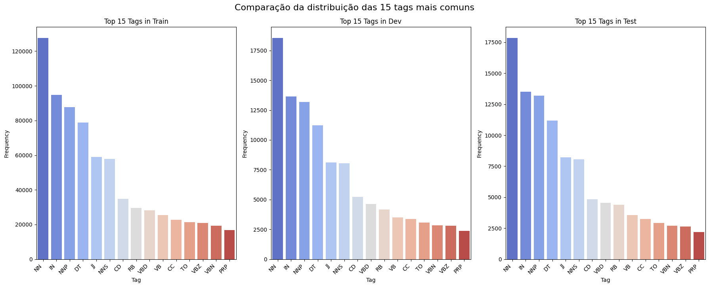
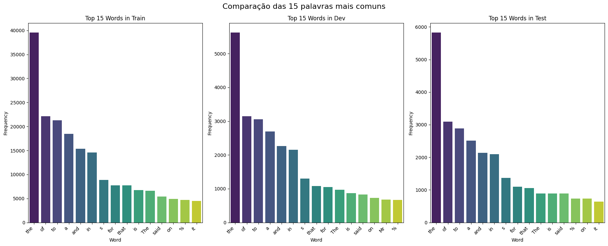
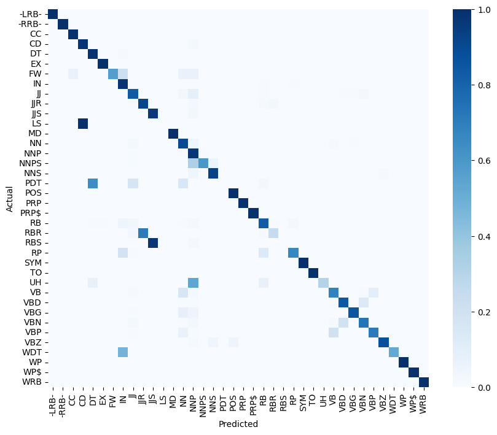
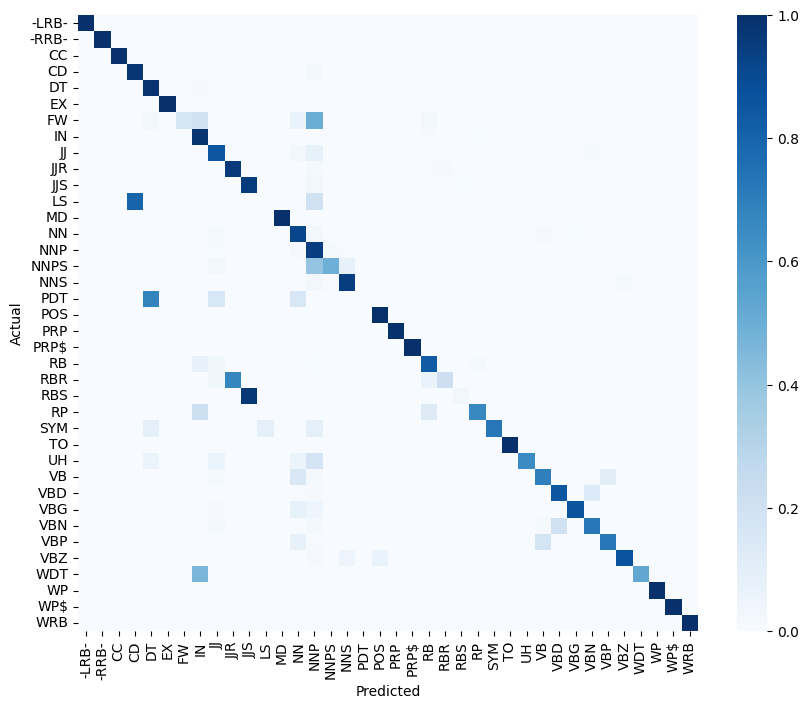
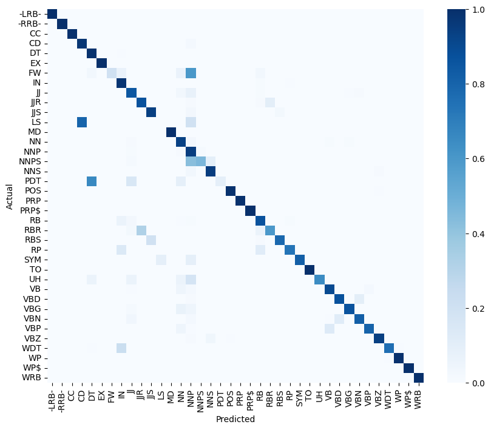
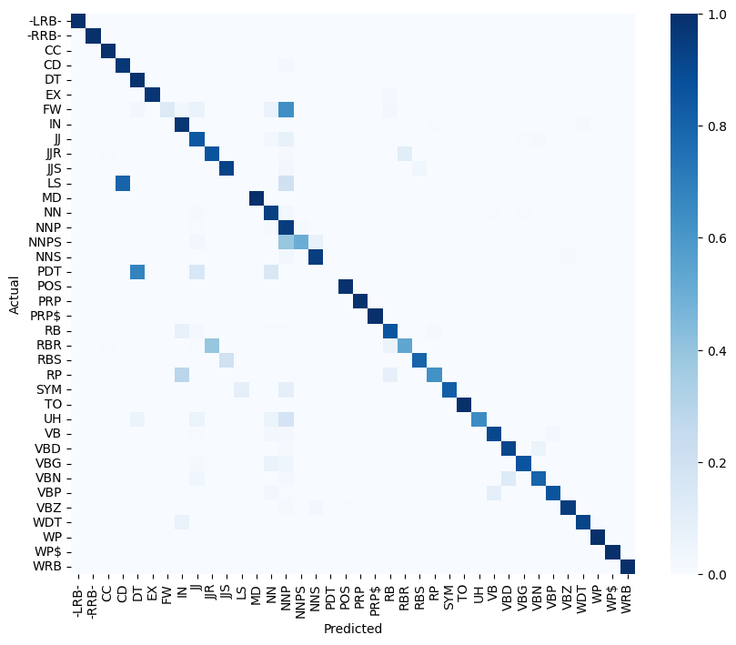

# part-of-speech-tagging
Trabalho da disciplina de processamento de linguagem natural, UFRN 2025.1
https://hmoodle.imd.ufrn.br/moodlep/mod/assign/view.php?id=2970

## 1. O objetivo
O objetivo do trabalho é implementar um part of speech tagger, ou seja, um programa que classifique as palavras em uma frase de acordo com sua classe gramatical (substantivo, adjetivo etc.). 
Os experimentos foram realizados com mais de uma técnica de treinamento e inferência, como o uso de unigramas, bigramas, trigramas e o condicionamento por tag no lugar de por palavra. 

## 2. Os dados
O [corpus utilizado](https://drive.google.com/drive/folders/19_F8mmI65lWnL6BmKvtzMX2Z_tcNlXxb) é composto por textos tratados do [Penn Treebank](https://paperswithcode.com/dataset/penn-treebank), com anotações no formato PALAVRA_TAG.

## 3. O treinamento
A "fase de treinamento", nesse contexto, é composta pela geração de um dataset que agregue informações específicas sobre cada palavra ou série de palavras no corpus. Esses datasets são gerados pelos programas na pasta `extractors`, sendo todos baseados nas seções `Secs0-18 - training` do Penn Treebank.

## 4. A inferência
A fase de inferência de tags é executada por um módulo de inferência chamado *driver*. O driver utiliza o dataset gerado na fase de treinamento e os conjuntos de desenvolvimento e teste do corpus para predizer a qual tag cada palavra pertence. Ao fim da fase de inferência, é gerado um dataset com as colunas `|Palavra|Tag Real|Tag Inferida|` para facilitar a análise futura dos resultados obtidos.

## 5. Análise exploratória

Descartamos, para esta análise, as tags e os tokens relativos aos seguintes elementos de pontuação:
`[',', '``', "''", '.', ';', '#', '%', "'", '"', "$", ":", "(", ")"]`

| Dataset | Tokens  | Palavras únicas | Tags únicas |
|:-------:|:-------:|:---------------:|:-----------:|
| Train   | 912344  | 42036           | 38          |
| Dev     | 131768  | 14822           | 38          |
| Test    | 129654  | 13710           | 38          |

As distribuições de tags para as 3 partições do corpus são apresentadas abaixo:

As 10 palavras mais comuns para cada arquivo são:

## 6 .Experimentos
- Todos os treinamentos foram realizados com o arquivo `Secs0-18 - training` e os testes de desenvolvimento com o arquivo `Secs19-21 - development`.
- Todos os experimentos foram realizados com o modelo de unigrama
### 6.1 Palavra desconhecida
A modelagem de palavra desconhecida é importante para que o programa possa ser mais generalista e não se limite apenas às palavras no corpus de treino.
#### 6.1.1 Removendo palavras com uma aparição
Com esse formato, todas as palavras do dataset de treino com apenas uma aparição foram alteradas para *unk-word*, definindo sua tag como a mais comum entre as palavras selecionadas. A tag definida foi NNP, dentre 22173 palavras selecionadas.
Utilizando este modelo no dataset de desenvolvimento, foram obtidos os seguintes resultados:

- Accuracy: 0.9056
- Precision: 0.8168
- Recall: 0.7792
- F1-Score: 0.7872

#### 6.1.2 Mantendo as palavras com uma aparição
Aplicando este método, as palavras com uma aparição não são alteradas para *unk-word*, mas suas tags são acumuladas para compor uma nova entrada para a *unk-word*.
Esse modelo trouxe os seguintes resultados:

- Accuracy: 0.9143
- Precision: 0.8181
- Recall: 0.7867
- F1-Score: 0.7922

Essa abordagem resultou em menos palavras sendo classificadas incorretamente como NNP e melhorando as métricas.

### 6.2 Normalização

#### 6.2.1 Modelo 1
Esse modelo mantém o experimento da seção 6.1.2 e trata palavras com e sem letras maiúsculas como palavras diferentes, por exemplo: mesmo que a palavra "factory" esteja no dataset de treino, caso nos testes seja encontrada a palavra "Factory", ela será modelada como "unk-word".

- Accuracy: 0.9143
- Precision: 0.8181
- Recall: 0.7867
- F1-Score: 0.7922

#### 6.2.2 Modelo 2
Esta segunda abordagem, antes de recorrer à palavra desconhecida, busca a palavra equivalente em lowercase e, em seguida, busca a palavra em forma capitalizada. Essa estratégia tem o objetivo de diminuir o número de vezes que recorremos à *unk-word* e melhorar as métricas do programa.

- Accuracy: 0.9136
- Precision: 0.8305
- Recall: 0.7897
- F1-Score: 0.7954

As métricas mostram um melhor equilíbrio entre as classes e uma maior facilidade em acertar classes menos comuns, mesmo que com erro maior no geral.
## Teste Final
- Os resultados finais reportados são de inferências sobre o conjunto `Secs22-24 - testing`
- Para o unigrama, foi utilizada a abordagem descrita na seção 6.2.2 para normalização e 6.1.2 para tratamento da palavra desconhecida.
- Para o smoothing de Bigramas e Trigramas, foi utilizada a técnica de Backoff.

### Unigrama

- Accuracy: 0.9159
- Precision: 0.8110
- Recall: 0.7771
- F1-Score: 0.7786
### Bigrama com palavras

- Accuracy: 0.9357
- Precision: 0.8572
- Recall: 0.8327
- F1-Score: 0.8408

### Trigrama com palavras

- Accuracy: 0.9354
- Precision: 0.8532
- Recall: 0.8308
- F1-Score: 0.8383
### Bigrama com tags

- Accuracy: 0.9370
- Precision: 0.8422
- Recall: 0.8291
- F1-Score: 0.8309
### Trigrama com tags

- Accuracy: 0.9367
- Precision: 0.8435
- Recall: 0.8262
- F1-Score: 0.8308
